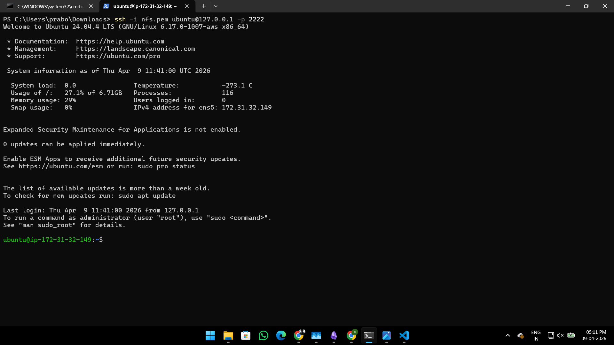
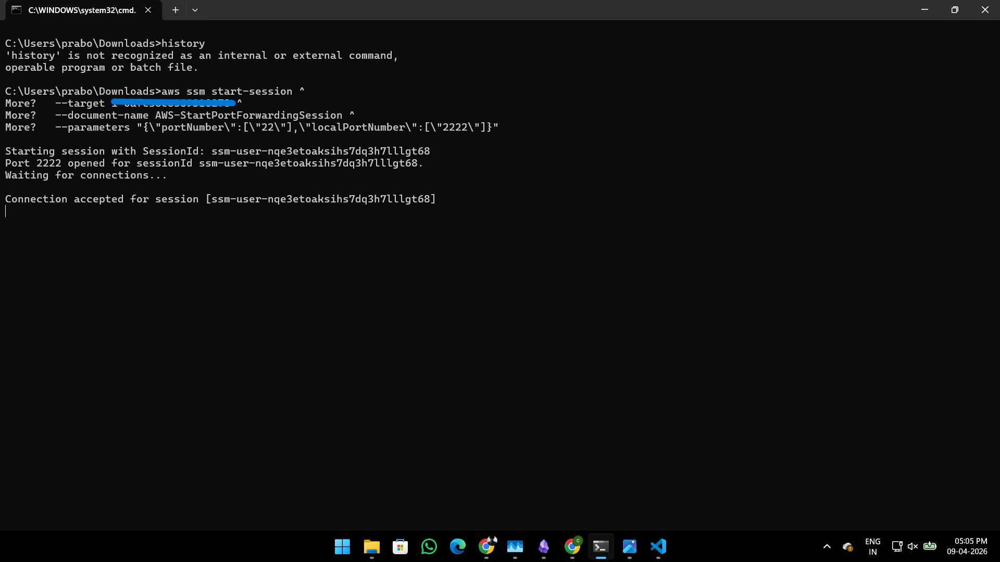
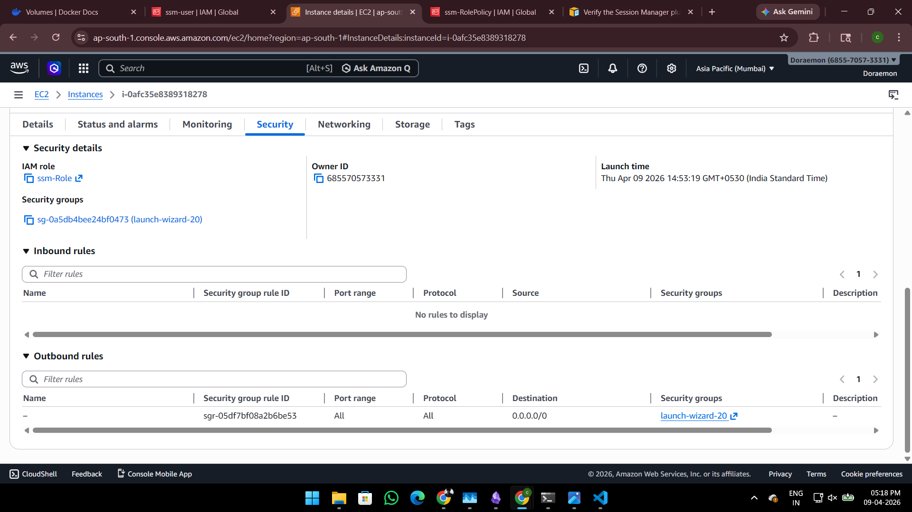

# 🔐 Secure EC2 Access using AWS SSM (Zero SSH Exposure)

## 📌 Overview

This implementation demonstrates how to securely access an EC2 instance without exposing SSH (port 22) using AWS Systems Manager (SSM).

---

## 🚨 Problem

Traditional SSH access:

* Requires opening port 22
* Exposes server to attacks
* Needs key management

---

## ✅ Solution

Use AWS SSM to:

* Remove public SSH access
* Use IAM-based authentication
* Enable secure tunneling

---

## 🏗️ Architecture


> Secure EC2 access via SSM without exposing SSH to the internet.

---

## ⚙️ Setup Guide

### 1. Attach IAM Role to EC2

Attach:

```
AmazonSSMManagedInstanceCore
```

---

### 2. Ensure SSM Agent is Running

```
sudo systemctl status amazon-ssm-agent
```

---

### 3. Create IAM User

* Enable programmatic access
* Attach policy from `/iam-policy`

---

### 4. Configure AWS CLI

Refer detailed guide:
👉 `aws-cli/aws-config-guide.md`

---

### 5. Install Session Manager Plugin

Verify:

```
session-manager-plugin
```

---

### 6. Start Session

```
aws ssm start-session --target <INSTANCE-ID>
```

---

### 7. Port Forwarding

```
aws ssm start-session \
  --target <INSTANCE-ID> \
  --document-name AWS-StartPortForwardingSession \
  --parameters '{"portNumber":["22"],"localPortNumber":["2222"]}'
```

---

### 8. SSH via Localhost

```
ssh -i your-key.pem ubuntu@127.0.0.1 -p 2222
```

---

## 📸 Proof

### SSM Session



### Port Forwarding



### Security Group



---

## 🔒 Security Benefits

* No public SSH port
* Reduced attack surface
* IAM-based authentication
* Encrypted communication

---

## 📌 Key Learnings

* SSM replaces SSH securely
* IAM policies control access
* Plugin is mandatory for sessions

---

## 🚀 Use Case

Used in production to replace:

* Bastion hosts
* Public SSH access

---

## 👨‍💻 Author

Prabool Bharti 

Implementation of secure EC2 access using AWS SSM.
