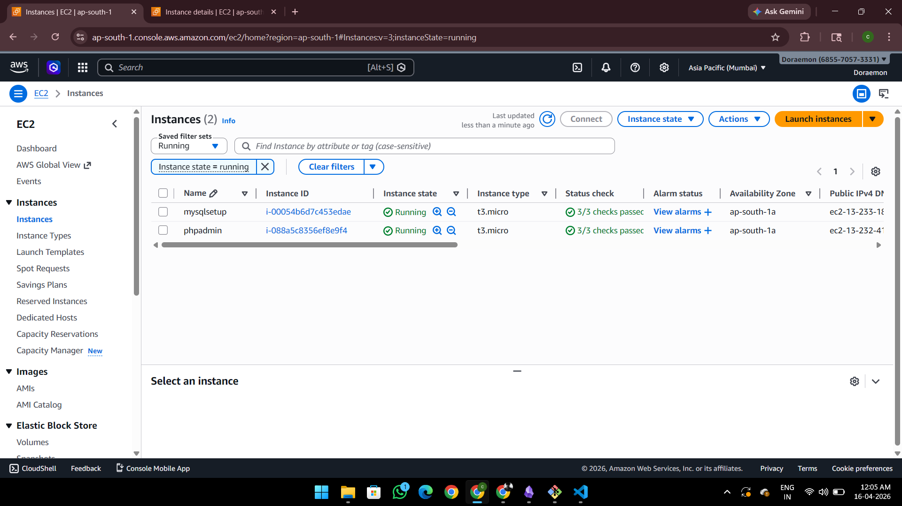
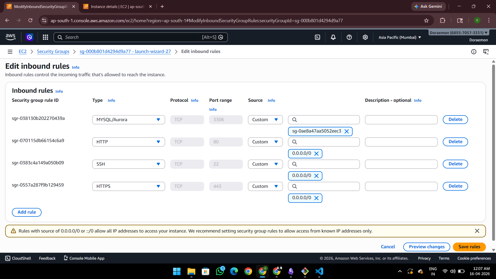
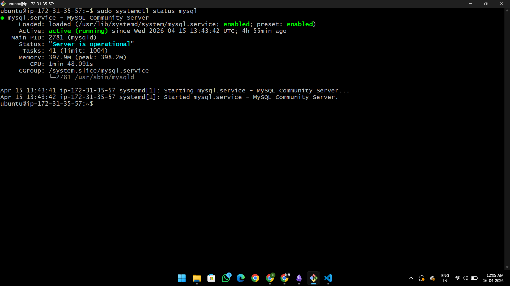
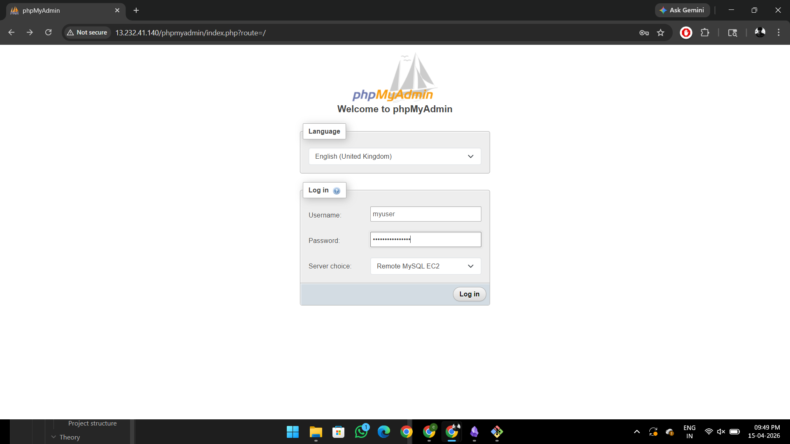
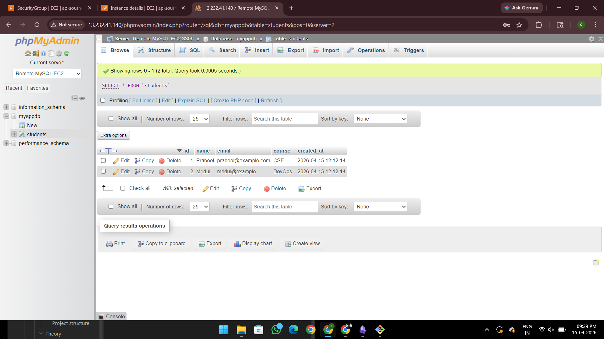

# 🚀 EC2 MySQL + phpMyAdmin (2-Instance Architecture)

## 📌 Overview

This project demonstrates a real-world cloud setup where:

- MySQL is hosted on one EC2 instance
- phpMyAdmin is hosted on another EC2 instance
- Secure communication is established using AWS Security Groups
- No public database exposure (secure architecture)

---

## 🧱 Architecture

[ phpMyAdmin EC2 ]  --->  [ MySQL EC2 ]  
      (UI Layer)         (Database Layer)

---

## ⚙️ Tech Stack

- AWS EC2 (Ubuntu)
- MySQL
- phpMyAdmin
- Apache
- Linux

---

## 🚀 Implementation Steps

Detailed setup guides are available in:

- 📁 `setup/mysql-setup.md`
- 📁 `setup/phpmyadmin-setup.md`
- 📁 `setup/security-group-setup.md`

---

## 📸 Screenshots

### 1️⃣ EC2 Instances
Shows both MySQL and phpMyAdmin instances running.

---

### 2️⃣ Security Group Configuration
MySQL instance allows access only from phpMyAdmin security group.

---

### 3️⃣ MySQL Running
Verifying MySQL service is active.

---

### 4️⃣ phpMyAdmin Login Page
Accessing phpMyAdmin UI via browser.

---

### 5️⃣ Table Data
Displaying `students` table with inserted records.

---

## 🔐 Security Implementation

- MySQL is NOT publicly exposed
- Uses **Security Group referencing** instead of IPs
- Internal AWS networking used (private communication)

---

## 🧠 Key Learnings

- Multi-EC2 architecture setup
- MySQL remote access configuration
- phpMyAdmin remote connection setup
- AWS Security Group best practices
- Debugging real-world connection issues

---

## ⚠️ Challenges Faced

See detailed file:

📄 `challenges.txt`

---

## 📂 Project Structure

ec2-mysql-phpmyadmin-setup/
│
├── README.md
├── challenges.txt
├── setup/
│ ├── mysql-setup.md
│ ├── phpmyadmin-setup.md
│ └── security-group-setup.md
│
├── configs/
│ ├── mysql-config.cnf
│ └── phpmyadmin-config.php
│
└── screenshots/
├── 1-ec2-instances.png
├── 2-security-group.png
├── 3-mysql-running.png
├── 4-phpmyadmin-ui.png
├── 5-database.png
└── 6-table-data.png

---

## 🚀 How to Run

1. Launch two EC2 instances
2. Setup MySQL on one instance
3. Setup phpMyAdmin on another instance
4. Configure security groups
5. Update phpMyAdmin config with MySQL host
6. Access phpMyAdmin via browser

---

## 📌 Future Improvements

- Add HTTPS (SSL)
- Use custom domain
- Integrate backend (Node.js / API)
- Automate using Terraform or Ansible

---

## 👨‍💻 Author

**Prabool Bharti**  
Cloud & DevOps Enthusiast 🚀