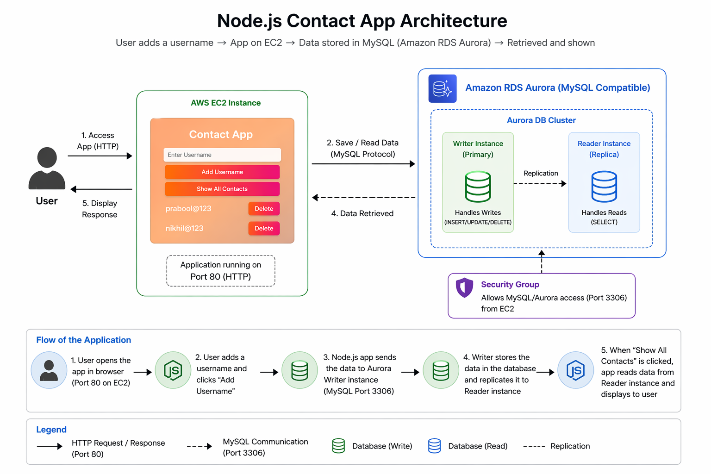
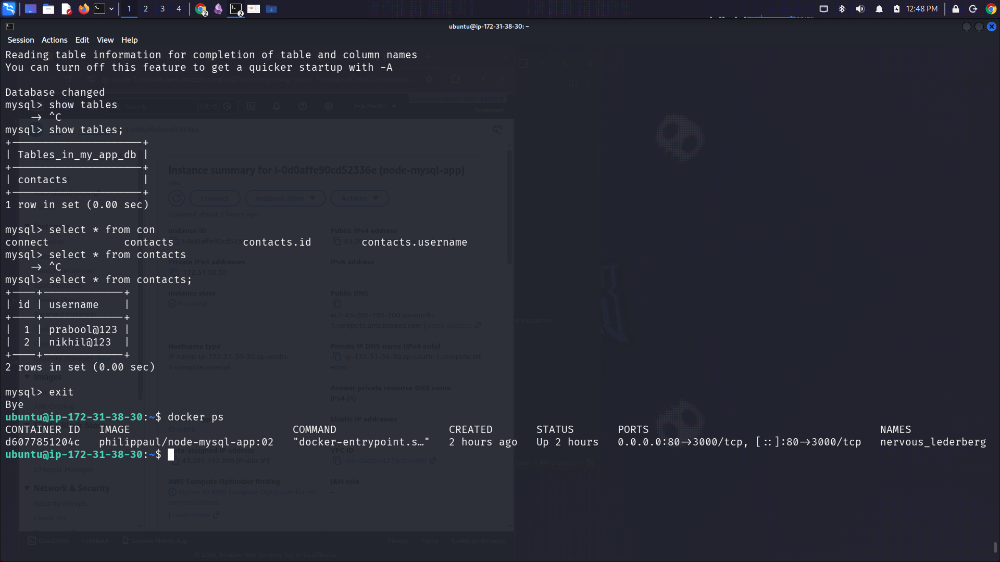
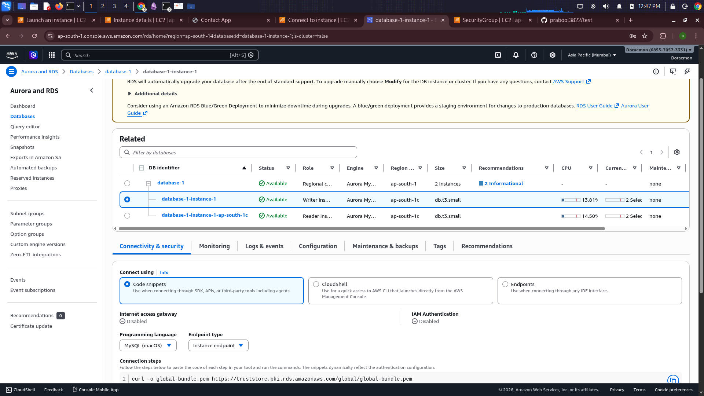
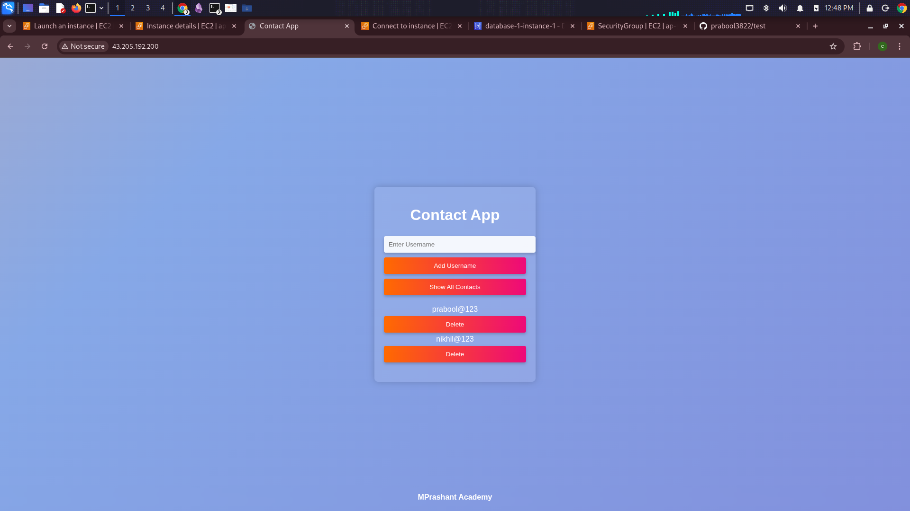

# 🚀 Node.js + Docker + AWS Aurora RDS Deployment

## 📌 Project Overview

This project demonstrates how to deploy a containerized Node.js application on AWS EC2 and connect it securely to an AWS Aurora (MySQL-compatible) database.

It showcases real-world DevOps concepts:

* Containerization using Docker
* Cloud database provisioning using AWS RDS (Aurora)
* Secure connectivity using Security Groups
* Environment-based configuration

---

## 🧱 Architecture

User → EC2 (Docker Container) → Aurora RDS (MySQL)


### 🔹 Architecture Visual



---

## 🧠 Aurora Database Architecture

### 🟢 Writer Instance

* Handles all write operations (INSERT, UPDATE, DELETE)

### 🔵 Reader Instance

* Handles read operations (SELECT)
* Improves scalability

> 📌 In this project: Only Writer instance is used

---

## ⚙️ Tech Stack

* Node.js (Docker Image)
* Docker
* AWS EC2
* AWS Aurora (MySQL)
* MySQL Client

---

## 🚀 Deployment

```bash
chmod +x deployment-commands.sh
./deployment-commands.sh
```

Then follow:
👉 [`commands.md`](./commands/commands.md)

---

## 📸 Screenshots

> Place all screenshots inside a folder named **`screenshots/`**

### 🔹 EC2 Instance Running Container



---

### 🔹 RDS Aurora Dashboard



---

### 🔹 Application UI (Add Username / Show Contacts)



---

## 📁 Project Structure

```id="qg7t8k"
rds-docker-node-app/
│
├── deployment-commands.sh
├── README.md
├── commands/
│   └── commands.md
├── docs/
│   └── rds-aurora-setup.md
└── screenshots/
    ├── ec2.png
    ├── rds.png
    └── app-ui.png
    └── architecture.png    


```

---

## ✅ Key Learnings

* Docker + Cloud DB integration
* AWS Aurora architecture (Writer/Reader)
* Security Groups and networking
* Environment variables in containers

---

## ⚠️ Improvements

* Restrict DB access
* Use Secrets Manager
* Add Load Balancer
* Enable Multi-AZ

---

## 👨‍💻 Author

Your Name
GitHub: https://github.com/prabool3822/

---
