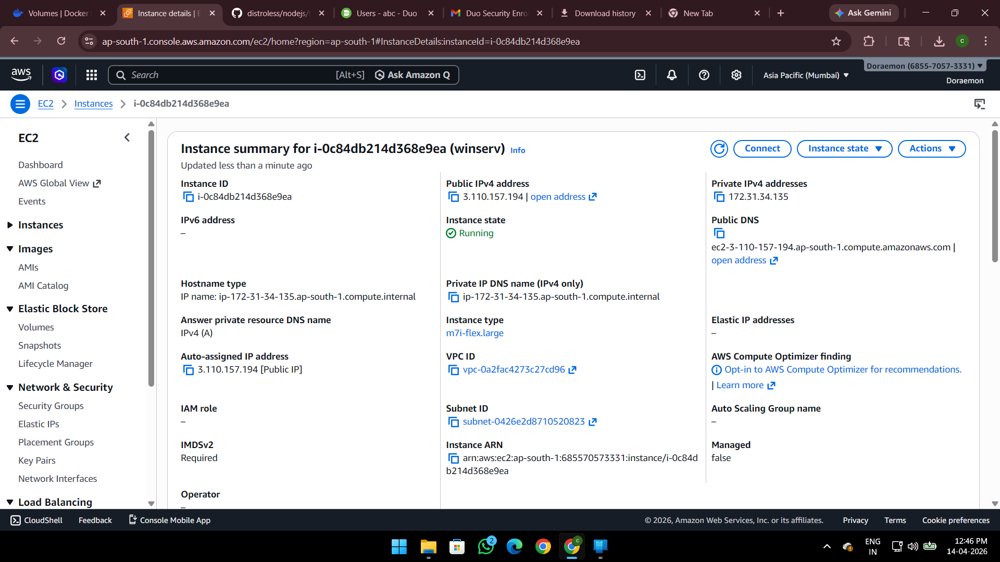
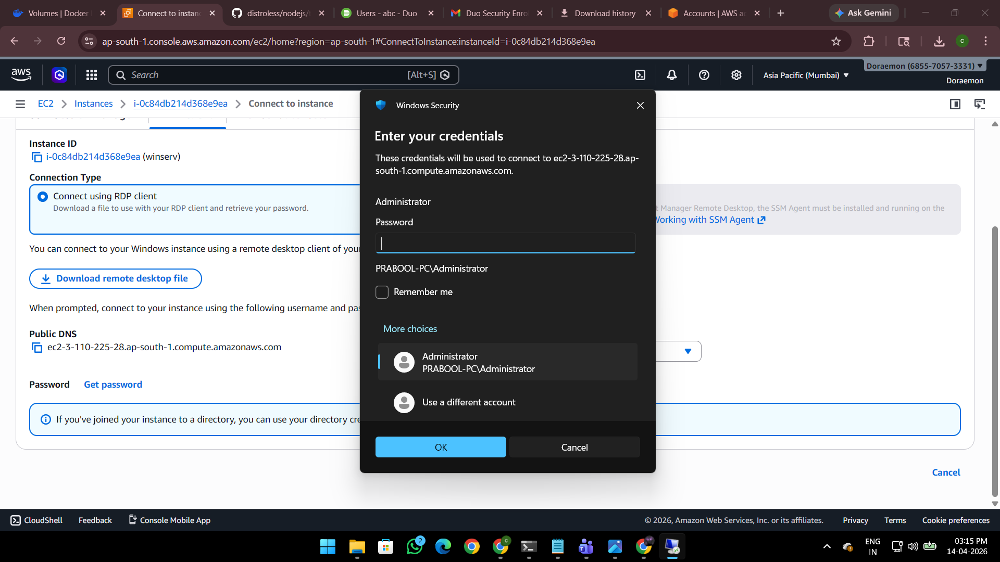
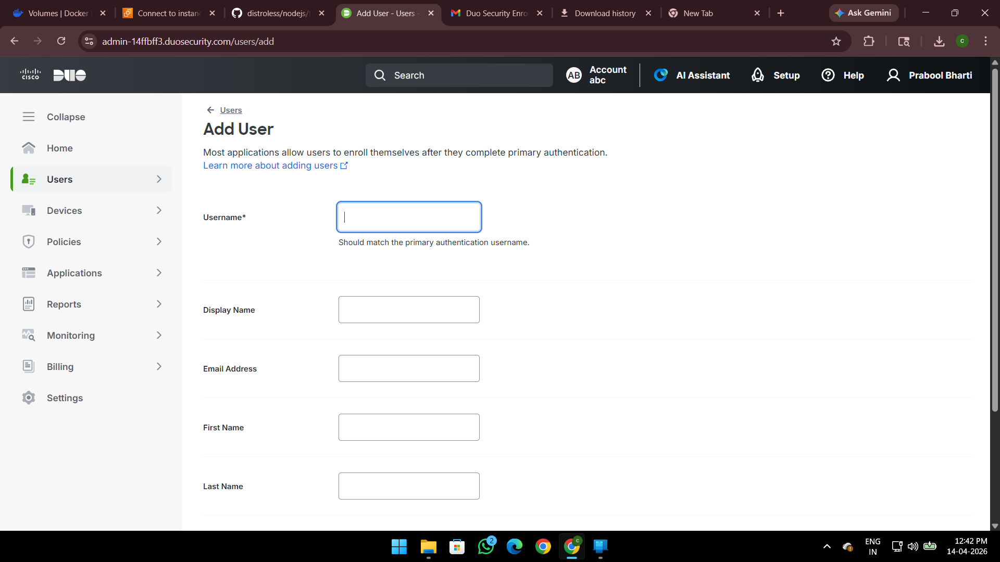
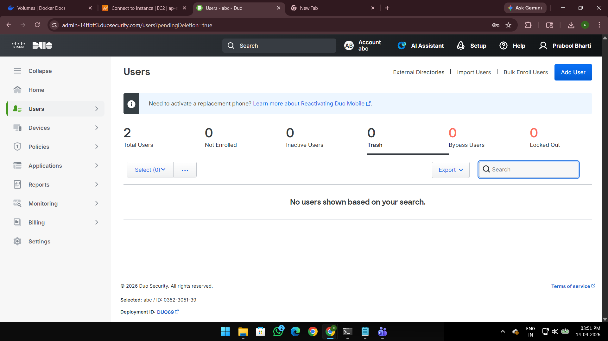
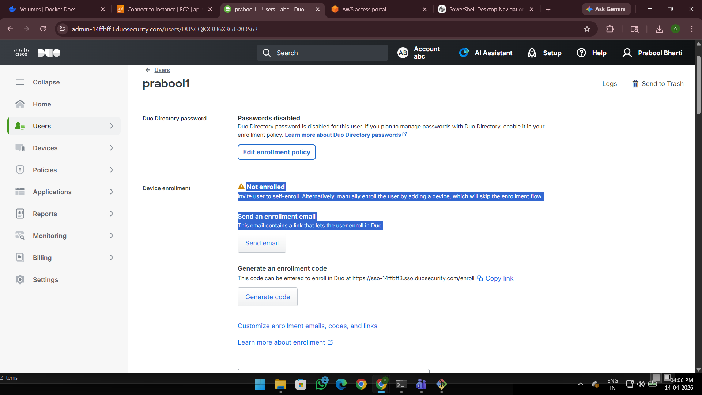
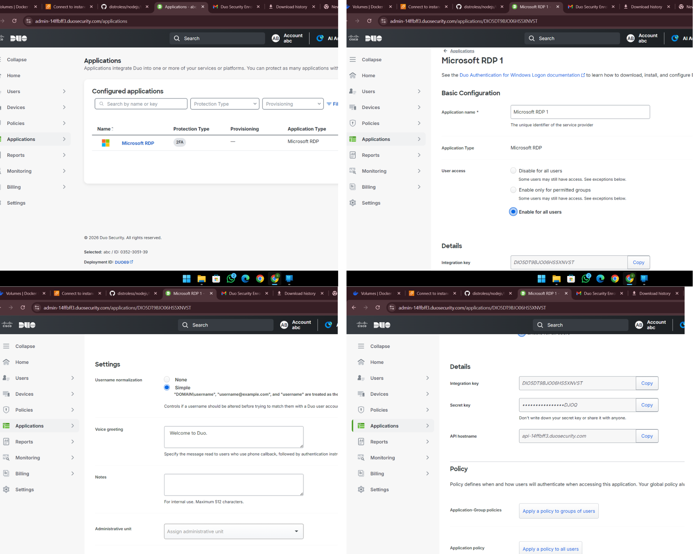
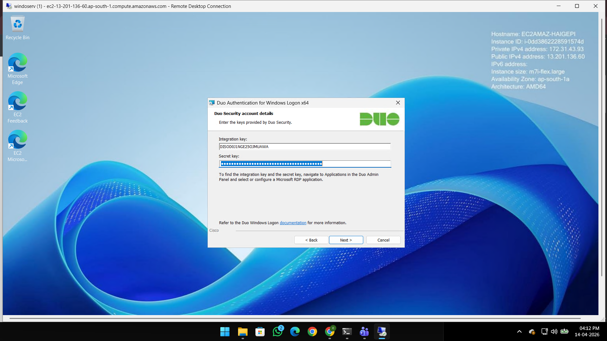
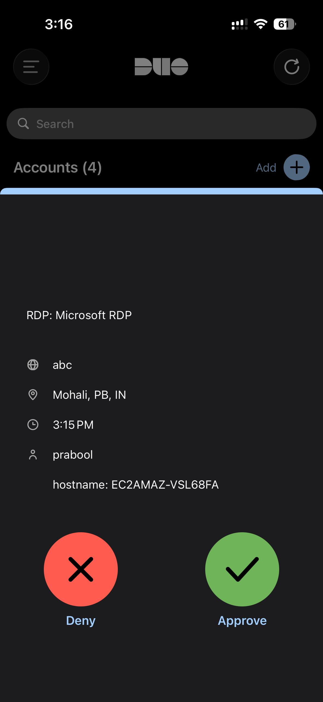
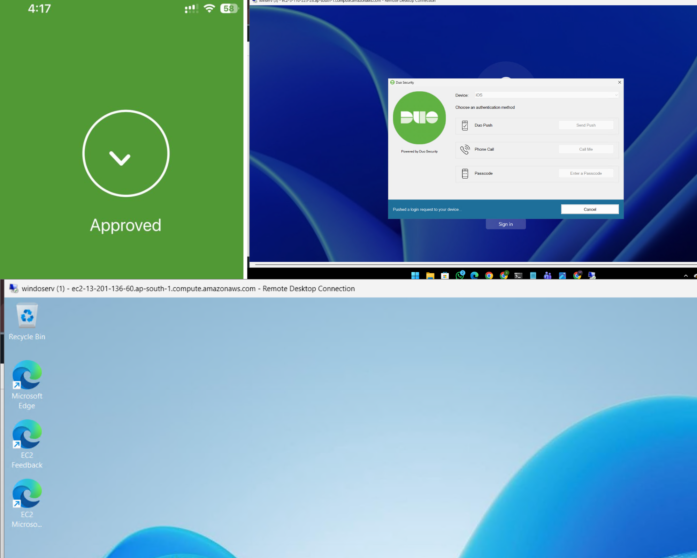

# 🔐 AWS EC2 Windows RDP Login with Duo 2FA

## 📌 Overview

This project demonstrates how to secure a Windows-based AWS EC2 instance using **Duo Multi-Factor Authentication (2FA)** for Remote Desktop Protocol (RDP) login.

The implementation integrates Duo at the **Windows logon level**, ensuring that users must approve a push notification before gaining access.

---

## 🧩 Architecture Diagram

---

## 🔐 Authentication Flow

1. User initiates RDP connection from laptop
2. Windows login screen appears
3. User enters username and password
4. Duo Authentication for Windows Logon is triggered
5. EC2 communicates with Duo Cloud
6. Duo sends push notification to user's device
7. User approves request in Duo Mobile app
8. Duo verifies authentication
9. User is granted access to Windows desktop

---

## 📸 Screenshots

| Step          | Screenshot                               |
| ------------- | ---------------------------------------- |
| EC2 Instance  |      |
| RDP Login     |         |
| User Creation |     |
| Duo Dashboard |     |
| Enrollment    |    |
| Duo RDP App   |       |
| Installation  |  |
| Duo Prompt    |        |
| Login Success |     |

---

## ⚙️ Implementation Details

Detailed step-by-step guide is available here:

📄 [Implementation Guide](docs/implementation-steps.md)

---

## 🧠 Key Concepts

* OS-level authentication using Duo
* Push-based multi-factor authentication
* Secure remote access to cloud instances
* Identity-based security over network-based security

---

## 🔐 Security Benefits

* Prevents unauthorized RDP access
* Adds second layer of authentication
* Protects against credential compromise
* Demonstrates real-world IAM security integration

---
sing IAM / SSM
* Add logging and monitoring
* Integrate with centralized identity provider

---

## 🚀 Future Improvements

* Restrict RDP access u
## 👨‍💻 Author

Prabool Bharti
