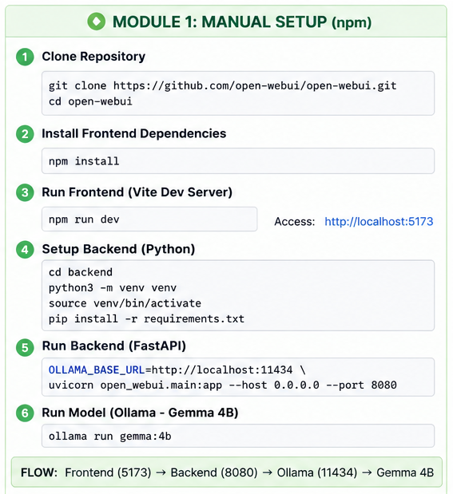
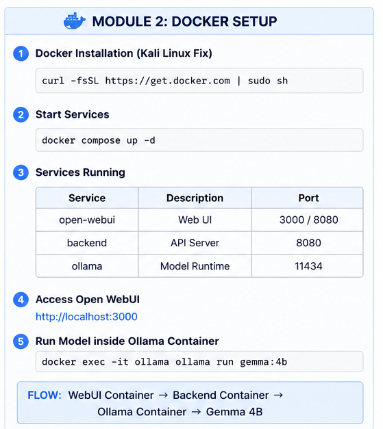
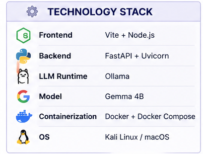
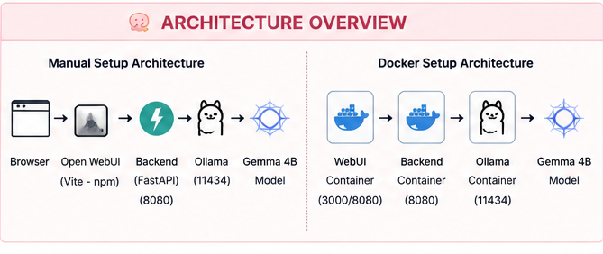
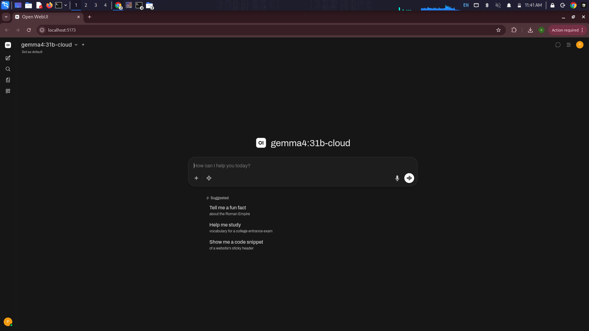
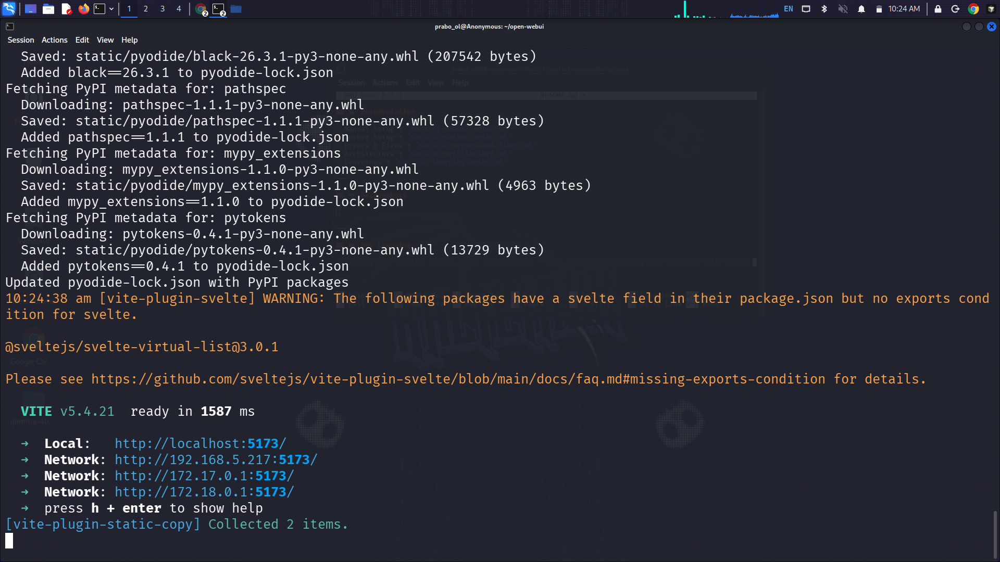
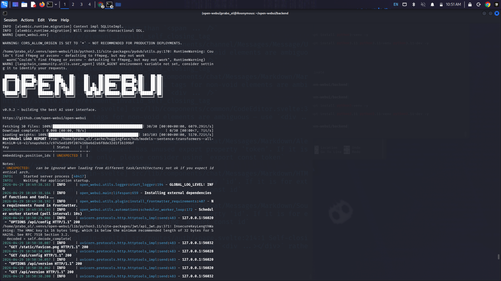
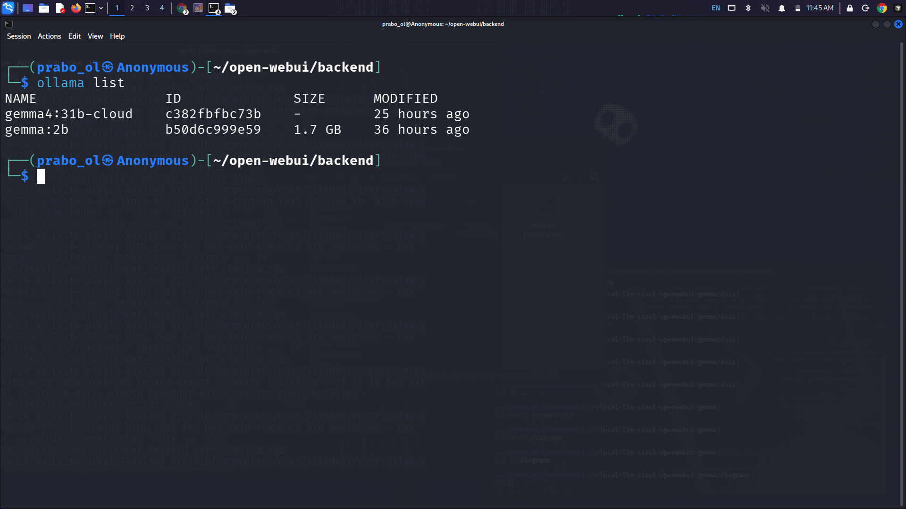
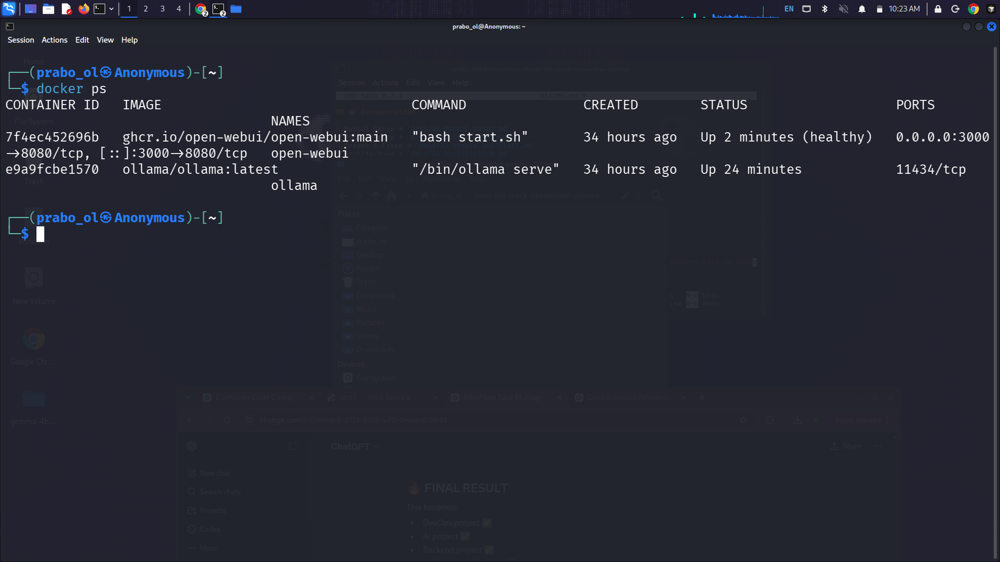

# 🚀 Local LLM Stack — Open WebUI + Ollama (Gemma)

Run a **local LLM (Gemma)** using **Open WebUI + Ollama** with both:

* Manual (npm + Python)
* Docker-based setup

## 🌐 Access URLs (Manual vs Docker)

### 🧩 Manual Setup (npm + backend)

When running:

```bash
npm run dev
```

You will see:

```
Local:   http://localhost:5173/
Network: http://192.168.x.x:5173/
Network: http://172.x.x.x:5173/
```

### 🏠 Manual setup guide


👉 Meaning:

* `localhost:5173` → access from same machine
* `192.168.x.x:5173` → access from your local network (same WiFi)
* `172.x.x.x:5173` → internal Docker/network interface

---

### 🐳 Docker Setup

When running containers:

```bash
docker run -p 3000:8080 ...
```

Access via:

```
http://localhost:3000
```

👉 Meaning:

* Port `3000` is exposed from container → host
* Inside container, app runs on `8080`

---

### 🏠 Docker setup 



## ⚠️ Important Difference

| Setup     | Port  | Description                |
| --------- | ----- | -------------------------- |
| Manual    | 5173  | Vite dev server (frontend) |
| Backend   | 8080  | FastAPI server             |
| Ollama    | 11434 | Model runtime              |
| Docker UI | 3000  | Exposed container UI       |

---

## 🧠 Key Insight

> Manual setup exposes multiple network interfaces (dev mode),
> while Docker exposes only mapped ports — making it cleaner and production-ready.


---

## 🧠 What This Project Shows

* Running LLM locally (no OpenAI API needed)
* Connecting frontend → backend → model runtime
* Debugging real-world DevOps issues
* Docker networking + service communication

---

## ⚙️ Tech Stack

| Layer       | Tech              |
| ----------- | ----------------- |
| Frontend    | Vite + Svelte     |
| Backend     | FastAPI + Uvicorn |
| LLM Runtime | Ollama            |
| Model       | Gemma 2B          |
| DevOps      | Docker            |

---

### 🏠 Tech-stack


## 🏗️ Architecture

```
Browser → Open WebUI → Backend (FastAPI) → Ollama → Gemma Model
```

---

### 🏠 Architecture



## 🚀 Quick Start (Docker)

```bash
docker network create openwebui-net

docker run -d \
  --name ollama \
  --network openwebui-net \
  -p 11434:11434 \
  ollama/ollama

docker run -d \
  --name open-webui \
  --network openwebui-net \
  -p 3000:8080 \
  -e OLLAMA_BASE_URL=http://ollama:11434 \
  ghcr.io/open-webui/open-webui:main
```

Open:

```
http://localhost:3000
```

---

## 📚 Documentation

* Manual Setup → `docs/01-manual-setup.md`
* Docker Setup → `docs/02-docker-setup.md`
* Errors & Fixes → `docs/03-errors-and-fixes.md`
* Architecture → `docs/04-architecture.md`
* Learnings → `docs/05-learning-notes.md`

---

## 📸 Screenshots

 ### Model screenshots





---

## 🧠 Key Learning

> Running LLM locally is not about installation — it's about understanding how services talk to each other.

---

## ⭐ Outcome

* Fully working local LLM system
* Web UI connected to model
* Both manual & containerized setup
* Real DevOps debugging experience
